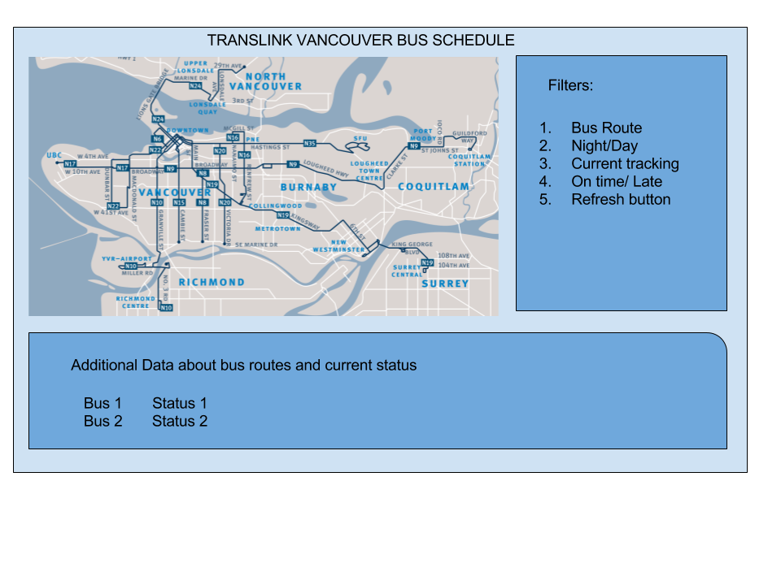

#1. Overview
-
I propose to build a translink web UI where users can track the number of buses on each route the current status of each bus on the route. The use case is that there is not enough information about the number of buses running on each route in the form of a web service. So this shiny app will fetch data in real time from the translink Web API website and show a map of the city of Vancouver and the various bus routes and times each bus is running on each route.

#2. Description of the data
-
I will fetch real time data from [Translink Web API](https://developer.translink.ca/) Here is the description of what the API can do or what will it return when queried:

1. The API default is to return XML data, however, it can return JSON if the content-type: application/JSON or accept: application/JSON is set in the http request header.
2. The API will require a unique API key to request for data.
3. The API key will authorize to offer a maximum of 1,000 requests per day for use of the Data. This is to prevent malicious users from abusing our service. 
4. The API will provide services for Stops, Buses, Stop Estimates, and Route details.
Route url site will be http://api.translink.ca.

#3. Usage scenario & tasks
-

Tim is a Vancouver resident and daily commuter to UBC. One day he decided to visit his aunt in Coquitlam but forgot to check if he had classes the next day. After reaching there he remembers that he has an assignement submission due the next day for which he has to go to UBC. Now, he has to [decide] whether he should stay back in Coquitlam and travel the next day. Or, go back to his aprtment on the commercial drive the same day. He knows he can get a 99-B line bus if he travels back to his house, but really wants to spend the night with his aunt's family. Thus in order to [compare] and [explore] his options, he opens up the translink shiny app that tells him how many buses run on the route from Coquitlam to UBC and what is there frequency. He discovers that only 2 buses run from his aunt's house to UBC and that too very late in the day. He then decides to take the bus back to his house the very same day without wasting much time. Thus, this is how the shiny app which shows all the translink data with bus routes helps Tim to make a decision.

#4. Description of app & initial sketch
-
The app contains a landing page with a map of metro Vancouver on the left hand side. This is accompanied by some buttons on the left hand side pane where we can filter the bus routes we are looking for, check for night time buses and their routes, track the buses whether they are on time or late, and refresh the page by clicking on a button.

The bottom half of the page contains additional information about the bus routes like textual information that could not be included on the map.

The data comes from the translink developer API and will be real time. 

Presented above is the initial sketch of the app.